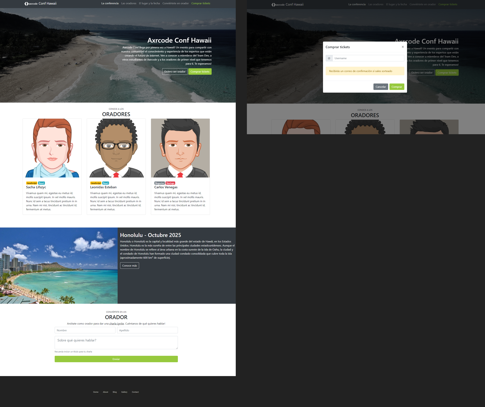

*********************************************************************************
                              DISEÑO PRÁCTICA
*********************************************************************************

Este es un proyecto de la clase de Desarrollo de Apps, el cuál consiste en un prototipo
clonando el diseño del mismo:



Este archivo es elaborado por el mismo creador del Repositorio @TheDangerousGT y el diseñador del prototipo por @axrcode

Para obtener el repositorio y sus actualizaciones debes usar

```
git clone https://github.com/TheDangerousGT/prototipo2.0.git
```

```
Copyright © TheDangerousGT
Todos los derechos reservados 
``` 

